# CatchTable API Workflows — Mermaid Catalog

Three places hold the same 30 diagrams:

- [`workflows.mmd`](./workflows.mmd) — single-file **catalog**, all diagrams
  concatenated with `BEGIN: NN-…` / `END: NN-…` markers. Read-only reference.
  *Cannot be opened directly in a strict Mermaid renderer* — a renderer
  expects one diagram per file and fails on the second `flowchart`.
- [`workflows/`](./workflows) — **30 standalone `.mmd` files**, one diagram
  each. Each file is valid Mermaid; drop into Mermaid Live / GitHub / mmdc /
  Cursor preview / Notion.
- This file (`workflows.md`) — every diagram inline as a `mermaid` fenced
  block in [§5 Appendix](#5-appendix--render-ready-diagrams). Renders natively
  on GitHub, VS Code, Notion, Obsidian, etc.

> **Note on naming.** The original prompt referenced "OpenAI API workflows".
> This repository does not contain OpenAI documentation; the attached folder
> `docs/api-docs/page-driven/` describes the **CatchTable** API. These files
> are named `workflows.*` to reflect that.

---

## 1. How to preview

| Tool | What to open |
| --- | --- |
| **GitHub / Notion / VS Code Markdown Preview** | This `.md` file — every diagram in the appendix renders inline. |
| **Mermaid Live Editor** ([mermaid.live](https://mermaid.live)) | Any [`workflows/NN-name.mmd`](./workflows). Copy → paste → render. |
| **`@mermaid-js/mermaid-cli`** | `mmdc -i workflows/08-reservation-state-machine.mmd -o 08.svg` |
| **Cursor / VS Code Mermaid extensions** | [`workflows/NN-name.mmd`](./workflows) (single-document mode). |
| **Render all 30 at once** | `cd workflows && npm install && npm run render` (uses your system Chrome via `_puppeteer.json`). |
| **Validate strictly (no renderer)** | `cd workflows && npm install && npm run validate` (uses the same Jison grammar as `mmdc`). |

`workflows.mmd` (the single file) is a **catalog** — useful for diffing,
grepping, and copy-pasting individual blocks, but **not** a valid
single-diagram Mermaid document. Always render from
[`workflows/`](./workflows) or from the appendix below.

**Validation status (last run):**

```
mermaid.parse  : 30/30 ok   (same Jison grammar as mmdc / Mermaid Live)
mmdc render    : 30/30 ok   (Chromium-based, real SVG output)
```

Re-run from `workflows/` with `npm run validate` and `npm run render`.

---

## 2. What's in the catalog

30 diagrams, grouped by area. The numbering matches the `BEGIN: NN-…` markers
inside `workflows.mmd`.

### Surface & data model

| # | Title | Type | What it answers |
| --- | --- | --- | --- |
| 01 | High-level API map | `flowchart` | Which actor talks to which tag group, and where data lands. |
| 02 | ER diagram of the 13-collection schema | `erDiagram` | Cross-collection relationships and the cache-on-user pattern. |

### Auth & onboarding

| # | Title | Type |
| --- | --- | --- |
| 03 | Authentication & token lifecycle | `sequenceDiagram` |
| 04 | Customer sign-up wizard (5 steps) | `flowchart` |
| 05 | Password reset (3 stages) | `sequenceDiagram` |
| 06 | Staff onboarding — register restaurant vs. join existing | `sequenceDiagram` |

### Discovery & reservations

| # | Title | Type |
| --- | --- | --- |
| 07 | Discovery → booking journey | `flowchart` |
| 08 | Reservation status state machine | `stateDiagram-v2` |
| 09 | Invite flow | `stateDiagram-v2` |
| 10 | QR check-in | `sequenceDiagram` |
| 11 | POS-side reservation actions (approve / decline / no-show / check-in) | `sequenceDiagram` |

### Orders, kitchen, payments

| # | Title | Type |
| --- | --- | --- |
| 12 | Order lifecycle (open → paid) | `flowchart` |
| 13 | Per-item / chef state | `stateDiagram-v2` |
| 14 | Kitchen board (Received / In Progress / Completed) | `sequenceDiagram` |
| 15 | POS payment (cash / credit / mix / wallet) | `sequenceDiagram` |
| 16 | Refund flow | `stateDiagram-v2` |

### Wallets, rewards, subscriptions

| # | Title | Type |
| --- | --- | --- |
| 17 | Wallet top-up (PSP webhook + poll fallback) | `sequenceDiagram` |
| 18 | Ledger + cache pattern (wallets & rewards) | `flowchart` |
| 19 | Subscription state — Pro & restaurant tier | `stateDiagram-v2` |
| 20 | Invoice state | `stateDiagram-v2` |

### Cross-cutting

| # | Title | Type |
| --- | --- | --- |
| 21 | Support conversation lifecycle | `stateDiagram-v2` |
| 22 | Notifications fanout (in-app, push, email/sms) | `flowchart` |
| 23 | Realtime channel map | `flowchart` |
| 24 | Idempotency-Key handling | `sequenceDiagram` |
| 25 | Error response + retry decision | `flowchart` |
| 26 | Pagination patterns (offset vs cursor) | `flowchart` |
| 27 | Table status state machine | `stateDiagram-v2` |
| 28 | Friend-edge state machine | `stateDiagram-v2` |
| 29 | Daily bonus + referral redemption | `sequenceDiagram` |
| 30 | Permissions matrix (staff roles → POS endpoints) | `flowchart` |

---

## 3. Source files

Diagrams were derived from these documents. Every status name, error code,
endpoint, and websocket channel is documented somewhere below.

**OpenAPI**

- `openapi/openapi.yaml` — root document, paths index, tag list
- `openapi/components/common.yaml` — `RealtimeChannel` enum, `ErrorCode` enum,
  Problem/Money/Pagination shapes, security schemes, idempotency header
- `openapi/components/schemas.yaml` — every domain entity (status enums for
  reservation, order, payment, refund, subscription, support, table, etc.)
- `openapi/paths/*.yaml` (18 files) — operations per area

**Schema (13-collection compromise)**

- `schema/README.md` and `schema/all-collections.md` — overview
- `schema/users.md`, `restaurants.md`, `reservations.md`, `orders.md`,
  `tables.md`, `payments.md`, `wallets.md`, `rewards.md`, `notifications.md`,
  `subscriptions.md`, `support.md`, `metadata.md`
- `schema/examples/*.json` — representative documents in MongoDB Extended JSON

**Page-driven specs (workflow narratives)**

- `reservation/Auth/README.md` — sign-in, sign-up, password reset, daily bonus
- `reservation/Discover/README.md` — Discover home feed
- `reservation/Explorer/README.md` — map + search
- `reservation/Reservation Flow/README.md` — 4-step booking wizard
- `reservation/Dining/README.md` — current/past reservations, ratings
- `reservation/Profile/README.md` — wallets, rewards, settings, support
- `pos/Auth/README.md` — staff sign-up (restaurant or join)
- `pos/Floor Plan/README.md` — floors, tables, calendar
- `pos/Orders/README.md` — order pad, dual-currency, payment modes
- `pos/Kitchen/README.md` — three-lane chef board
- `pos/Analytics/README.md` — dashboards
- `pos/Settings/README.md` — staff/roles, deposit cards, plans

---

## 4. Assumptions and TODOs that need human verification

Items marked `%% TODO: …` inside `workflows.mmd` plus everything below are
places where the docs are silent or under-specified.

1. **Permissions enum (diagram 30).** `pos/Settings/README.md` describes the
   permission dialog and `pos/Orders/README.md` mentions `Take Orders`,
   `Process Payment`, etc., but the canonical permission strings are not
   exhaustively listed in the OpenAPI yet. The matrix uses plausible names
   (`orders.take`, `payments.process`, `payments.refund`, `kitchen.act`,
   `reservations.approve`, …). **Verify against the eventual `Permission`
   enum or the staff token claim shape.**

2. **Auto-approval of reservations (diagram 08).** Several docs imply that a
   restaurant may opt into auto-approval (a setting), but the toggle is not
   in `RestaurantSettings` in `schemas.yaml`. The state machine treats it as
   a possibility but does not name a setting field. **Confirm whether
   auto-approval is a real product feature.**

3. **`reservation.timeline.entries[].type` vs. `reservation.status`.** The
   timeline uses extra entry types (`order_opened`, `bill_finalized`, `paid`,
   `cancelled_by_user`, `cancelled_by_restaurant`) that don't appear in the
   top-level `status` enum. Diagram 08 treats those as **timeline notes only**
   — the reservation state remains in `dining` / `bill` / `visited`. Verify
   that `status` doesn't transition into intermediate values not listed.

4. **Order top-level status.** `orders.md` and `pos/Orders/README.md` discuss
   `open → paid → voided` but the OpenAPI `OrderResponse` schema does not
   surface a single canonical `status` enum. Diagram 12 uses the documented
   POS-side flow (`open · with sent items · bill_requested · bill · paid ·
   voided`) but **the exact field name should be checked against
   `schemas.yaml#Order`.**

5. **`bill_requested` vs `bill` reservation state.** Both appear in the
   reservation status enum. Diagram 08 wires them sequentially
   (`dining → bill_requested → bill → visited`) which matches the customer
   "Request bill" tap → POS finalize-bill split, but the docs are not 100%
   explicit about who triggers each. **Verify which actor causes which
   transition.**

6. **Refund retry mechanics (diagram 16).** PSPs vary; the docs say the
   `payments.refunds[]` row carries its own status timeline but do not
   specify backoff intervals or max attempts. Diagram 16 says "retryable"
   without committing to a count.

7. **Subscription past-due → expired vs cancelled (diagram 19).** The schema
   allows both `cancelled` and `expired`. The transition rules (which one is
   chosen when retries fail at end-of-period) are inferred. **Confirm the
   policy in `schema/subscriptions.md`.**

8. **Wallet top-up "draft" ledger row (diagram 17).** `customer-wallets.yaml`
   says the row is uncommitted until the PSP webhook fires. The mechanism
   (separate `processing` collection? a flag on the row?) is not nailed
   down. The diagram represents it as a draft row inside `wallet_transactions`.
   **Verify implementation strategy.**

9. **Idempotency cache TTL (diagram 24).** `IdempotencyKeyHeader` says
   "Keys live 24h"; the per-route scoping rules and replay headers are
   inferred from common patterns. Verify against the eventual middleware
   spec.

10. **Realtime channel access control (diagram 23).** Channel names are
    documented; the per-actor authorization rules ("customer only sees their
    own reservation events", "staff only sees their restaurant's events")
    are inferred and not part of the OpenAPI surface. The diagram annotates
    these with dashed edges. **Verify the WS auth layer.**

11. **Refund auto-trigger on `:decline` (diagram 11).** The page-driven docs
    imply the deposit is automatically refunded on `:decline`, but the
    OpenAPI `PosDecline` operation does not describe a side-effect refund
    in detail. Confirm automation vs. manual.

12. **Push token storage.** Diagram 22 says push tokens live on
    `customer_users.devices[]` (per the agreed compromise schema, push
    tokens are NOT a separate collection). This was a deliberate design
    decision that may have shifted; **re-check `schema/users.md`.**

---

## 5. Appendix — render-ready diagrams

Each section below is a copy of the matching block in `workflows.mmd`,
wrapped in a `mermaid` fenced block so the markdown renderer (GitHub, VS
Code, Notion) can render it directly without any tooling.

### 01. High-level API map

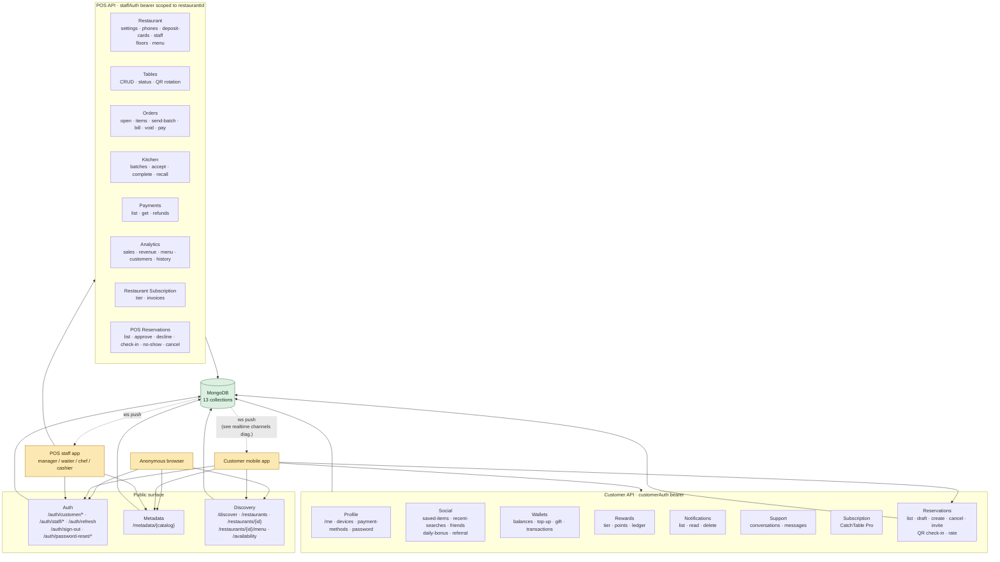
```mermaid
flowchart TD
    Cust["Customer mobile app"]:::actor
    Pos["POS staff app<br/>manager / waiter / chef / cashier"]:::actor
    Anon["Anonymous browser"]:::actor

    subgraph Public["Public surface"]
        AuthSvc["Auth<br/>/auth/customer/* · /auth/staff/* · /auth/refresh<br/>/auth/sign-out · /auth/password-reset/*"]
        Meta["Metadata<br/>/metadata/{catalog}"]
        Disc["Discovery<br/>/discover · /restaurants · /restaurants/{id}<br/>/restaurants/{id}/menu · /availability"]
    end

    subgraph CustomerAPI["Customer API · customerAuth bearer"]
        Prof["Profile<br/>/me · devices · payment-methods · password"]
        Soc["Social<br/>saved-items · recent-searches · friends<br/>daily-bonus · referral"]
        Wall["Wallets<br/>balances · top-up · gift · transactions"]
        Rew["Rewards<br/>tier · points · ledger"]
        Notif["Notifications<br/>list · read · delete"]
        Sup["Support<br/>conversations · messages"]
        CSub["Subscription<br/>CatchTable Pro"]
        Res["Reservations<br/>list · draft · create · cancel · invite<br/>QR check-in · rate"]
    end

    subgraph PosAPI["POS API · staffAuth bearer scoped to restaurantId"]
        PR["Restaurant<br/>settings · phones · deposit-cards · staff<br/>floors · menu"]
        PT["Tables<br/>CRUD · status · QR rotation"]
        PO["Orders<br/>open · items · send-batch · bill · void · pay"]
        PK["Kitchen<br/>batches · accept · complete · recall"]
        PP["Payments<br/>list · get · refunds"]
        PA["Analytics<br/>sales · revenue · menu · customers · history"]
        PSub["Restaurant Subscription<br/>tier · invoices"]
        PRes["POS Reservations<br/>list · approve · decline · check-in · no-show · cancel"]
    end

    DB[("MongoDB<br/>13 collections")]:::store

    Anon --> AuthSvc
    Anon --> Meta
    Anon --> Disc

    Cust --> AuthSvc
    Cust --> CustomerAPI
    Cust --> Disc
    Cust --> Meta
    Cust --> Res

    Pos --> AuthSvc
    Pos --> PosAPI
    Pos --> Meta

    AuthSvc --> DB
    Meta --> DB
    Disc --> DB
    CustomerAPI --> DB
    PosAPI --> DB
    Res --> DB

    DB -. "ws push<br/>(see realtime channels diag.)" .-> Cust
    DB -. "ws push" .-> Pos

    classDef actor fill:#fce8b2,stroke:#a87a00,color:#3a2a00
    classDef store fill:#dcefe1,stroke:#2f6e43,color:#0d3a1d
```

### 02. ER diagram of the 13-collection schema

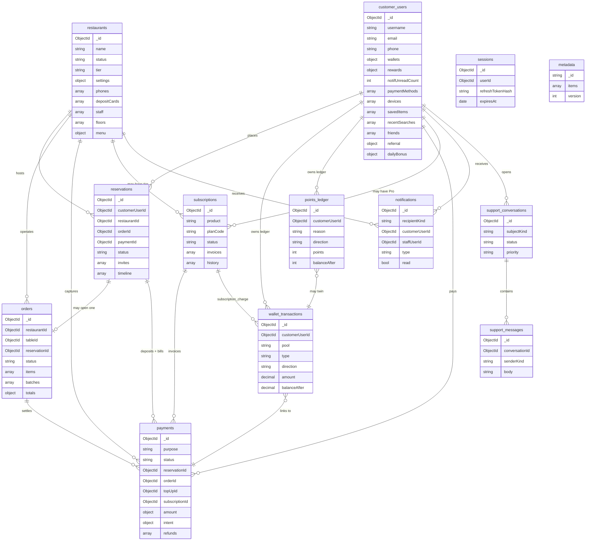
```mermaid
erDiagram
    customer_users ||--o{ reservations : "places"
    customer_users ||--o{ wallet_transactions : "owns ledger"
    customer_users ||--o{ points_ledger : "owns ledger"
    customer_users ||--o{ payments : "pays"
    customer_users ||--o{ subscriptions : "may have Pro"
    customer_users ||--o{ notifications : "receives"
    customer_users ||--o{ support_conversations : "opens"

    restaurants ||--o{ reservations : "hosts"
    restaurants ||--o{ orders : "operates"
    restaurants ||--o{ payments : "captures"
    restaurants ||--o{ subscriptions : "may have tier"
    restaurants ||--o{ notifications : "receives"

    reservations ||--o| orders : "may open one"
    reservations ||--o{ payments : "deposits + bills"

    orders ||--o{ payments : "settles"

    subscriptions ||--o{ payments : "invoices"
    subscriptions ||--o{ wallet_transactions : "subscription_charge"

    wallet_transactions }o--|| payments : "links to"
    points_ledger }o--|| wallet_transactions : "may twin"

    support_conversations ||--o{ support_messages : "contains"

    customer_users {
        ObjectId _id
        string username
        string email
        string phone
        object wallets
        object rewards
        int    notifUnreadCount
        array  paymentMethods
        array  devices
        array  savedItems
        array  recentSearches
        array  friends
        object referral
        object dailyBonus
    }
    restaurants {
        ObjectId _id
        string name
        string status
        string tier
        object settings
        array  phones
        array  depositCards
        array  staff
        array  floors
        object menu
    }
    reservations {
        ObjectId _id
        ObjectId customerUserId
        ObjectId restaurantId
        ObjectId orderId
        ObjectId paymentId
        string   status
        array    invites
        array    timeline
    }
    orders {
        ObjectId _id
        ObjectId restaurantId
        ObjectId tableId
        ObjectId reservationId
        string   status
        array    items
        array    batches
        object   totals
    }
    payments {
        ObjectId _id
        string   purpose
        string   status
        ObjectId reservationId
        ObjectId orderId
        ObjectId topUpId
        ObjectId subscriptionId
        object   amount
        object   intent
        array    refunds
    }
    wallet_transactions {
        ObjectId _id
        ObjectId customerUserId
        string   pool
        string   type
        string   direction
        decimal  amount
        decimal  balanceAfter
    }
    points_ledger {
        ObjectId _id
        ObjectId customerUserId
        string   reason
        string   direction
        int      points
        int      balanceAfter
    }
    notifications {
        ObjectId _id
        string   recipientKind
        ObjectId customerUserId
        ObjectId staffUserId
        string   type
        bool     read
    }
    support_conversations {
        ObjectId _id
        string   subjectKind
        string   status
        string   priority
    }
    support_messages {
        ObjectId _id
        ObjectId conversationId
        string   senderKind
        string   body
    }
    subscriptions {
        ObjectId _id
        string   product
        string   planCode
        string   status
        array    invoices
        array    history
    }
    sessions {
        ObjectId _id
        ObjectId userId
        string   refreshTokenHash
        date     expiresAt
    }
    metadata {
        string   _id
        array    items
        int      version
    }
```

### 03. Authentication & token lifecycle

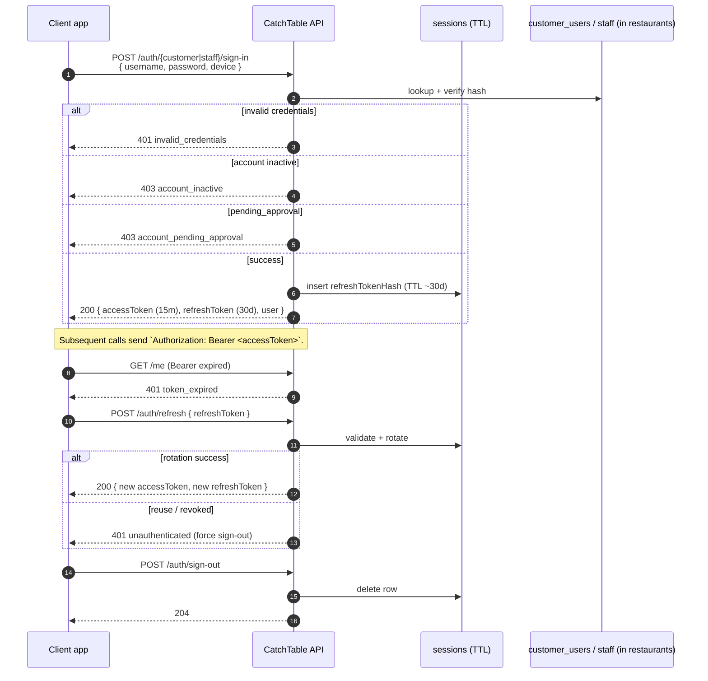
```mermaid
sequenceDiagram
    autonumber
    participant App as Client app
    participant API as CatchTable API
    participant Sess as sessions (TTL)
    participant Users as customer_users / staff (in restaurants)

    App->>API: POST /auth/{customer|staff}/sign-in<br/>{ username, password, device }
    API->>Users: lookup + verify hash
    alt invalid credentials
        API-->>App: 401 invalid_credentials
    else account inactive
        API-->>App: 403 account_inactive
    else pending_approval
        API-->>App: 403 account_pending_approval
    else success
        API->>Sess: insert refreshTokenHash (TTL ~30d)
        API-->>App: 200 { accessToken (15m), refreshToken (30d), user }
    end

    Note over App,API: Subsequent calls send `Authorization: Bearer <accessToken>`.

    App->>API: GET /me   (Bearer expired)
    API-->>App: 401 token_expired

    App->>API: POST /auth/refresh { refreshToken }
    API->>Sess: validate + rotate
    alt rotation success
        API-->>App: 200 { new accessToken, new refreshToken }
    else reuse / revoked
        API-->>App: 401 unauthenticated  (force sign-out)
    end

    App->>API: POST /auth/sign-out
    API->>Sess: delete row
    API-->>App: 204
```

### 04. Customer sign-up wizard

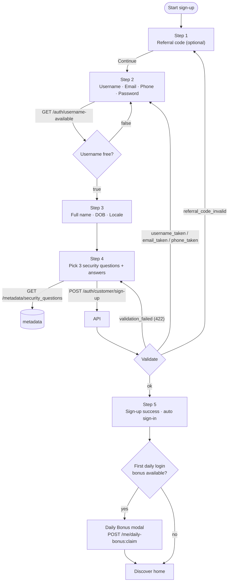
```mermaid
flowchart TD
    Start([Start sign-up]) --> S1["Step 1<br/>Referral code (optional)"]
    S1 -->|Continue| S2["Step 2<br/>Username · Email · Phone · Password"]
    S2 -->|"GET /auth/username-available"| AvCheck{"Username free?"}
    AvCheck -- "false" --> S2
    AvCheck -- "true" --> S3["Step 3<br/>Full name · DOB · Locale"]
    S3 --> S4["Step 4<br/>Pick 3 security questions + answers"]
    S4 -->|"GET /metadata/security_questions"| MetaQ[(metadata)]
    S4 -->|"POST /auth/customer/sign-up"| API[API]
    API --> Val{"Validate"}
    Val -- "username_taken / email_taken / phone_taken" --> S2
    Val -- "validation_failed (422)" --> S4
    Val -- "referral_code_invalid" --> S1
    Val -- "ok" --> S5["Step 5<br/>Sign-up success · auto sign-in"]
    S5 --> Bonus{"First daily login<br/>bonus available?"}
    Bonus -- yes --> DB["Daily Bonus modal<br/>POST /me/daily-bonus:claim"]
    Bonus -- no --> Home["Discover home"]
    DB --> Home
```

### 05. Password reset

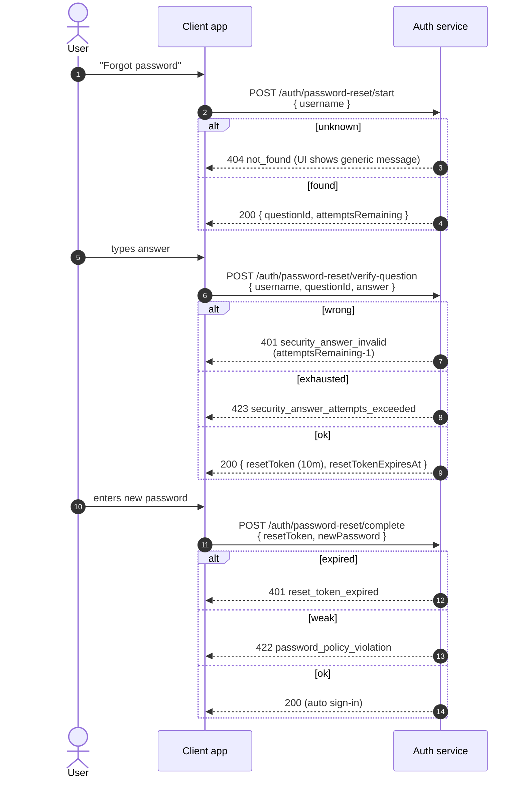
```mermaid
sequenceDiagram
    autonumber
    actor User
    participant App as Client app
    participant API as Auth service

    User->>App: "Forgot password"
    App->>API: POST /auth/password-reset/start<br/>{ username }
    alt unknown
        API-->>App: 404 not_found  (UI shows generic message)
    else found
        API-->>App: 200 { questionId, attemptsRemaining }
    end

    User->>App: types answer
    App->>API: POST /auth/password-reset/verify-question<br/>{ username, questionId, answer }
    alt wrong
        API-->>App: 401 security_answer_invalid<br/>(attemptsRemaining-1)
    else exhausted
        API-->>App: 423 security_answer_attempts_exceeded
    else ok
        API-->>App: 200 { resetToken (10m), resetTokenExpiresAt }
    end

    User->>App: enters new password
    App->>API: POST /auth/password-reset/complete<br/>{ resetToken, newPassword }
    alt expired
        API-->>App: 401 reset_token_expired
    else weak
        API-->>App: 422 password_policy_violation
    else ok
        API-->>App: 200 (auto sign-in)
    end
```

### 06. Staff onboarding

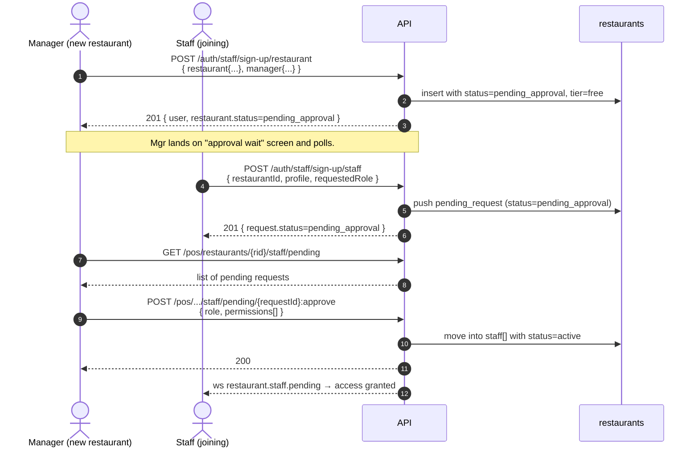
```mermaid
sequenceDiagram
    autonumber
    actor Mgr as Manager (new restaurant)
    actor Stf as Staff (joining)
    participant API as API
    participant R as restaurants

    Mgr->>API: POST /auth/staff/sign-up/restaurant<br/>{ restaurant{...}, manager{...} }
    API->>R: insert with status=pending_approval, tier=free
    API-->>Mgr: 201 { user, restaurant.status=pending_approval }
    Note over Mgr,API: Mgr lands on "approval wait" screen and polls.

    Stf->>API: POST /auth/staff/sign-up/staff<br/>{ restaurantId, profile, requestedRole }
    API->>R: push pending_request (status=pending_approval)
    API-->>Stf: 201 { request.status=pending_approval }

    Mgr->>API: GET /pos/restaurants/{rid}/staff/pending
    API-->>Mgr: list of pending requests
    Mgr->>API: POST /pos/.../staff/pending/{requestId}:approve<br/>{ role, permissions[] }
    API->>R: move into staff[] with status=active
    API-->>Mgr: 200
    API-->>Stf: ws restaurant.staff.pending → access granted
```

### 07. Discovery → booking journey

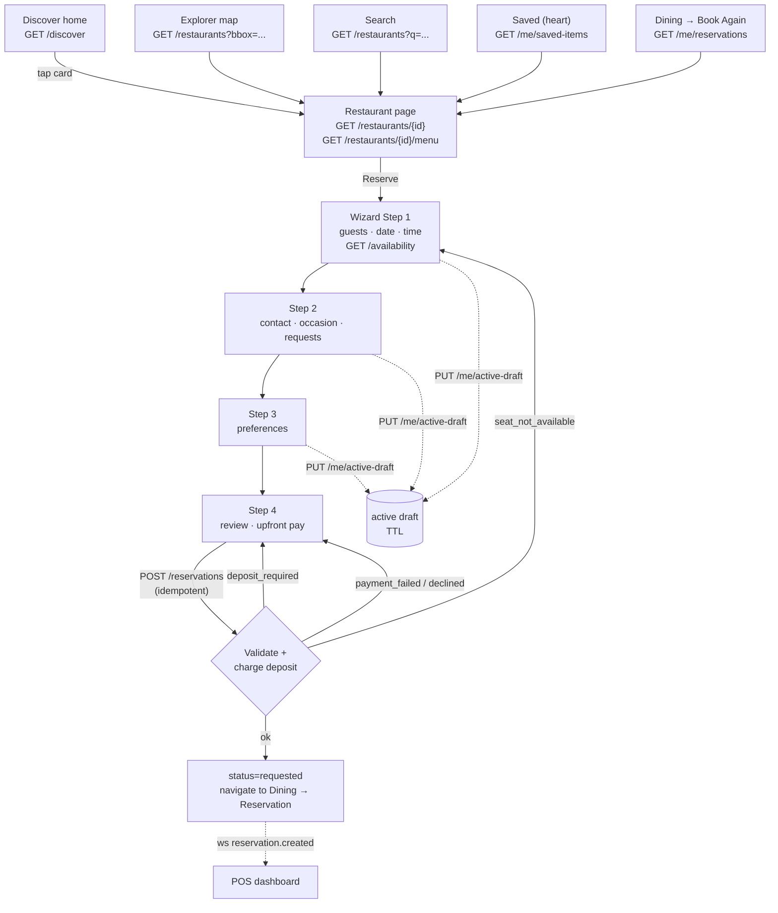
```mermaid
flowchart TD
    Home["Discover home<br/>GET /discover"] -->|"tap card"| Detail["Restaurant page<br/>GET /restaurants/{id}<br/>GET /restaurants/{id}/menu"]
    Map["Explorer map<br/>GET /restaurants?bbox=..."] --> Detail
    Search["Search<br/>GET /restaurants?q=..."] --> Detail
    Saved["Saved (heart)<br/>GET /me/saved-items"] --> Detail
    Dining["Dining → Book Again<br/>GET /me/reservations"] --> Detail

    Detail -->|"Reserve"| W1["Wizard Step 1<br/>guests · date · time<br/>GET /availability"]
    W1 --> W2["Step 2<br/>contact · occasion · requests"]
    W2 --> W3["Step 3<br/>preferences"]
    W3 --> W4["Step 4<br/>review · upfront pay"]

    W1 -. "PUT /me/active-draft" .-> Draft[("active draft<br/>TTL")]
    W2 -. "PUT /me/active-draft" .-> Draft
    W3 -. "PUT /me/active-draft" .-> Draft

    W4 -->|"POST /reservations<br/>(idempotent)"| Confirm{"Validate +<br/>charge deposit"}
    Confirm -- "seat_not_available" --> W1
    Confirm -- "deposit_required" --> W4
    Confirm -- "payment_failed / declined" --> W4
    Confirm -- "ok" --> Done["status=requested<br/>navigate to Dining → Reservation"]
    Done -. "ws reservation.created" .-> POSStaff[POS dashboard]
```

### 08. Reservation status state machine

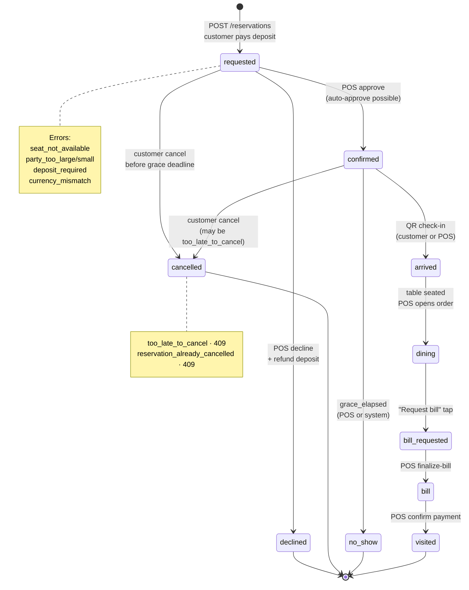
```mermaid
stateDiagram-v2
    [*] --> requested : POST /reservations<br/>customer pays deposit

    requested --> confirmed : POS approve<br/>(auto-approve possible)
    requested --> declined  : POS decline<br/>+ refund deposit
    requested --> cancelled : customer cancel<br/>before grace deadline

    confirmed --> arrived       : QR check-in<br/>(customer or POS)
    confirmed --> cancelled     : customer cancel<br/>(may be too_late_to_cancel)
    confirmed --> no_show       : grace_elapsed<br/>(POS or system)

    arrived --> dining          : table seated<br/>POS opens order
    dining  --> bill_requested  : "Request bill" tap
    bill_requested --> bill     : POS finalize-bill
    bill --> visited            : POS confirm payment

    declined  --> [*]
    cancelled --> [*]
    no_show   --> [*]
    visited   --> [*]

    note right of requested
      Errors:
        seat_not_available
        party_too_large/small
        deposit_required
        currency_mismatch
    end note
    note right of cancelled
      too_late_to_cancel · 409
      reservation_already_cancelled · 409
    end note
```

### 09. Invite flow

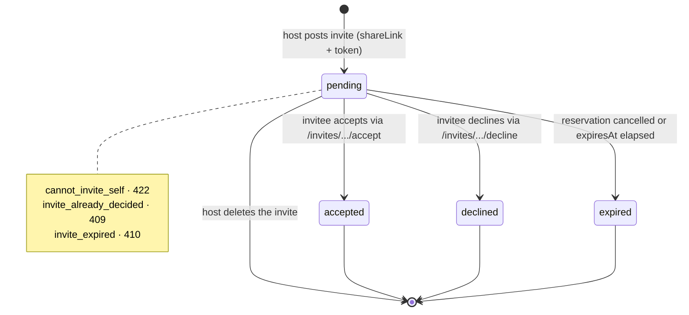
```mermaid
stateDiagram-v2
    [*] --> pending : host posts invite (shareLink + token)
    pending --> accepted : invitee accepts via /invites/.../accept
    pending --> declined : invitee declines via /invites/.../decline
    pending --> expired  : reservation cancelled or expiresAt elapsed
    pending --> [*] : host deletes the invite

    accepted --> [*]
    declined --> [*]
    expired  --> [*]

    note right of pending
      cannot_invite_self · 422
      invite_already_decided · 409
      invite_expired · 410
    end note
```

### 10. QR check-in

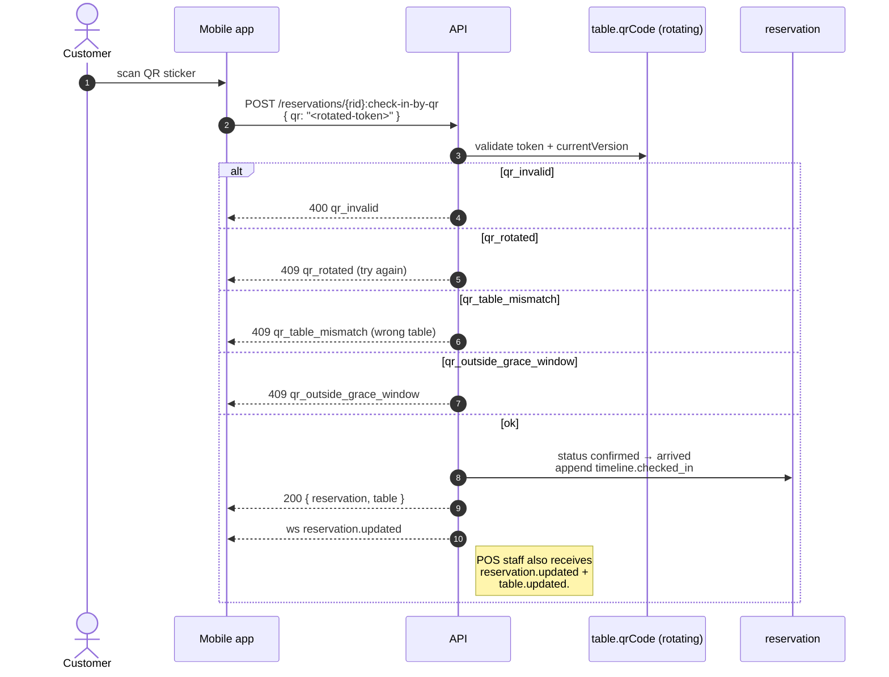
```mermaid
sequenceDiagram
    autonumber
    actor Cust as Customer
    participant App as Mobile app
    participant API as API
    participant Tbl as table.qrCode (rotating)
    participant Res as reservation

    Cust->>App: scan QR sticker
    App->>API: POST /reservations/{rid}:check-in-by-qr<br/>{ qr: "<rotated-token>" }
    API->>Tbl: validate token + currentVersion
    alt qr_invalid
        API-->>App: 400 qr_invalid
    else qr_rotated
        API-->>App: 409 qr_rotated  (try again)
    else qr_table_mismatch
        API-->>App: 409 qr_table_mismatch  (wrong table)
    else qr_outside_grace_window
        API-->>App: 409 qr_outside_grace_window
    else ok
        API->>Res: status confirmed → arrived<br/>append timeline.checked_in
        API-->>App: 200 { reservation, table }
        API-->>App: ws reservation.updated
        Note right of API: POS staff also receives<br/>reservation.updated +<br/>table.updated.
    end
```

### 11. POS-side reservation actions

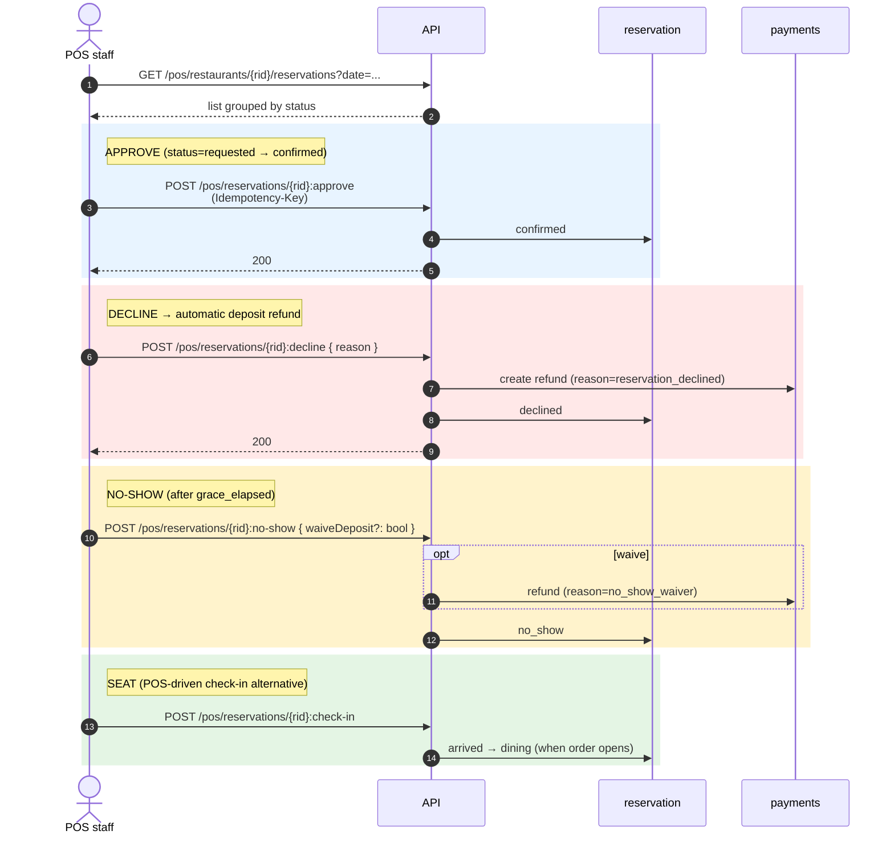
```mermaid
sequenceDiagram
    autonumber
    actor Pos as POS staff
    participant API as API
    participant Res as reservation
    participant Pay as payments

    Pos->>API: GET /pos/restaurants/{rid}/reservations?date=...
    API-->>Pos: list grouped by status

    rect rgb(232,244,255)
    note right of Pos: APPROVE  (status=requested → confirmed)
    Pos->>API: POST /pos/reservations/{rid}:approve<br/>(Idempotency-Key)
    API->>Res: confirmed
    API-->>Pos: 200
    end

    rect rgb(255,232,232)
    note right of Pos: DECLINE → automatic deposit refund
    Pos->>API: POST /pos/reservations/{rid}:decline { reason }
    API->>Pay: create refund (reason=reservation_declined)
    API->>Res: declined
    API-->>Pos: 200
    end

    rect rgb(255,243,204)
    note right of Pos: NO-SHOW  (after grace_elapsed)
    Pos->>API: POST /pos/reservations/{rid}:no-show { waiveDeposit?: bool }
    opt waive
        API->>Pay: refund (reason=no_show_waiver)
    end
    API->>Res: no_show
    end

    rect rgb(228,245,228)
    note right of Pos: SEAT  (POS-driven check-in alternative)
    Pos->>API: POST /pos/reservations/{rid}:check-in
    API->>Res: arrived → dining (when order opens)
    end
```

### 12. Order lifecycle

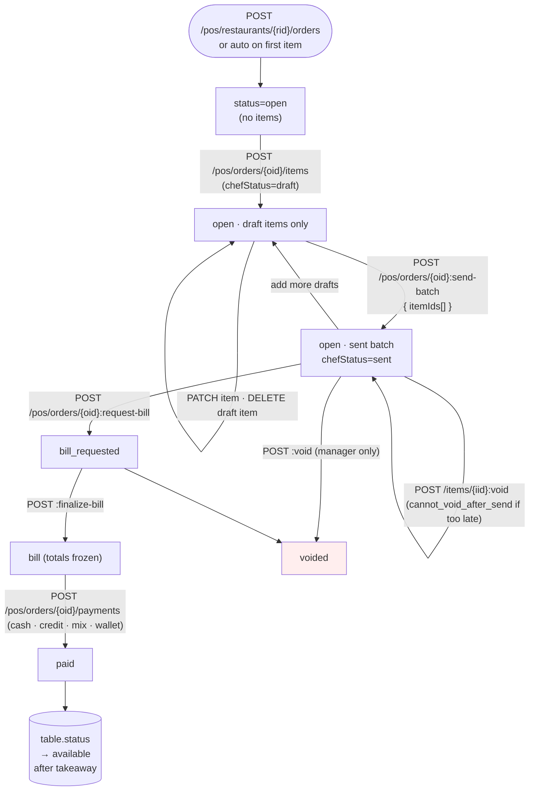
```mermaid
flowchart TD
    Open(["POST /pos/restaurants/{rid}/orders<br/>or auto on first item"])
    Open --> S0["status=open<br/>(no items)"]

    S0 -->|"POST /pos/orders/{oid}/items<br/>(chefStatus=draft)"| S1["open · draft items only"]
    S1 -->|"PATCH item · DELETE draft item"| S1
    S1 -->|"POST /pos/orders/{oid}:send-batch<br/>{ itemIds[] }"| S2["open · sent batch<br/>chefStatus=sent"]

    S2 -->|"add more drafts"| S1
    S2 -->|"PATCH /items/{iid} (already sent) → delta batch"| S2
    S2 -->|"POST /items/{iid}:void  (cannot_void_after_send if too late)"| S2

    S2 -->|"POST /pos/orders/{oid}:request-bill"| S3["bill_requested"]
    S3 -->|"POST :finalize-bill"| S4["bill (totals frozen)"]
    S4 -->|"POST /pos/orders/{oid}/payments  (cash · credit · mix · wallet)"| S5["paid"]

    S2 -->|"POST :void  (manager only)"| Sx["voided"]
    S3 --> Sx

    S5 --> tableFlip[("table.status<br/>→ available<br/>after takeaway")]
    style Sx fill:#fee
```

### 13. Per-item / chef state

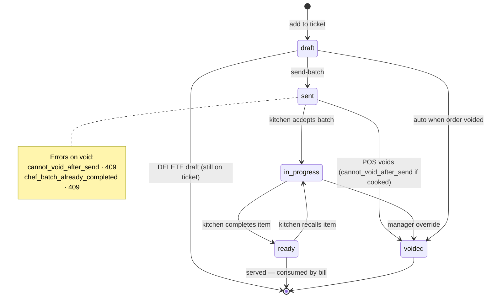
```mermaid
stateDiagram-v2
    [*] --> draft : add to ticket
    draft --> sent : send-batch
    draft --> [*] : DELETE draft (still on ticket)
    sent --> in_progress : kitchen accepts batch
    in_progress --> ready : kitchen completes item
    ready --> in_progress : kitchen recalls item
    ready --> [*] : served — consumed by bill

    sent --> voided : POS voids (cannot_void_after_send if cooked)
    in_progress --> voided : manager override
    draft --> voided : auto when order voided
    voided --> [*]

    note right of sent
      Errors on void:
        cannot_void_after_send · 409
        chef_batch_already_completed · 409
    end note
```

### 14. Kitchen board

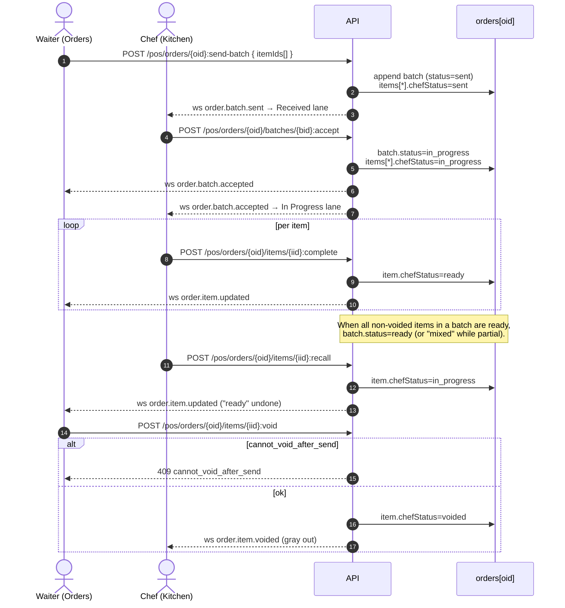
```mermaid
sequenceDiagram
    autonumber
    actor Wt as Waiter (Orders)
    actor Ch as Chef (Kitchen)
    participant API as API
    participant Order as orders[oid]

    Wt->>API: POST /pos/orders/{oid}:send-batch { itemIds[] }
    API->>Order: append batch (status=sent)<br/>items[*].chefStatus=sent
    API-->>Ch: ws order.batch.sent → Received lane

    Ch->>API: POST /pos/orders/{oid}/batches/{bid}:accept
    API->>Order: batch.status=in_progress<br/>items[*].chefStatus=in_progress
    API-->>Wt: ws order.batch.accepted
    API-->>Ch: ws order.batch.accepted → In Progress lane

    loop per item
        Ch->>API: POST /pos/orders/{oid}/items/{iid}:complete
        API->>Order: item.chefStatus=ready
        API-->>Wt: ws order.item.updated
    end

    Note over API,Order: When all non-voided items in a batch are ready,<br/>batch.status=ready (or "mixed" while partial).

    Ch->>API: POST /pos/orders/{oid}/items/{iid}:recall
    API->>Order: item.chefStatus=in_progress
    API-->>Wt: ws order.item.updated  ("ready" undone)

    Wt->>API: POST /pos/orders/{oid}/items/{iid}:void
    alt cannot_void_after_send
        API-->>Wt: 409 cannot_void_after_send
    else ok
        API->>Order: item.chefStatus=voided
        API-->>Ch: ws order.item.voided  (gray out)
    end
```

### 15. POS payment (cash / credit / mix / wallet)

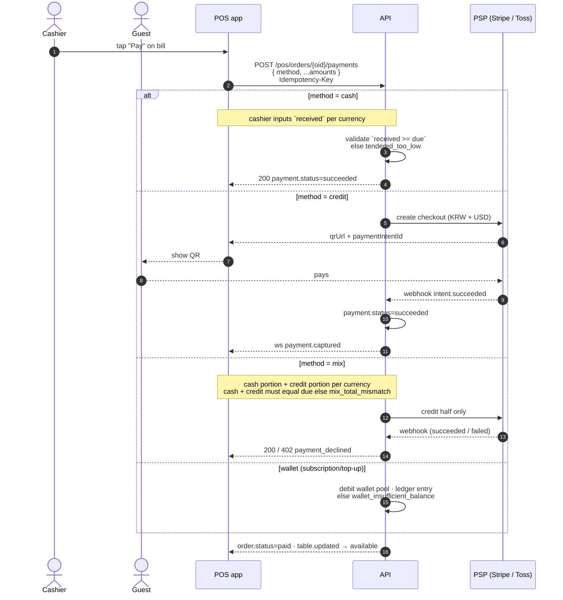
```mermaid
sequenceDiagram
    autonumber
    actor Cs as Cashier
    actor Guest
    participant App as POS app
    participant API as API
    participant PSP as PSP (Stripe / Toss)

    Cs->>App: tap "Pay" on bill
    App->>API: POST /pos/orders/{oid}/payments<br/>{ method, ...amounts }<br/>Idempotency-Key

    alt method = cash
        Note over App,API: cashier inputs `received` per currency
        API->>API: validate `received >= due`<br/>else tendered_too_low
        API-->>App: 200 payment.status=succeeded
    else method = credit
        API->>PSP: create checkout (KRW + USD)
        PSP-->>App: qrUrl + paymentIntentId
        App-->>Guest: show QR
        Guest-->>PSP: pays
        PSP-->>API: webhook intent.succeeded
        API->>API: payment.status=succeeded
        API-->>App: ws payment.captured
    else method = mix
        Note over App,API: cash portion + credit portion per currency<br/>cash + credit must equal due else mix_total_mismatch
        API->>PSP: credit half only
        PSP-->>API: webhook (succeeded / failed)
        API-->>App: 200 / 402 payment_declined
    else wallet (subscription/top-up)
        API->>API: debit wallet pool · ledger entry<br/>else wallet_insufficient_balance
    end

    API-->>App: order.status=paid · table.updated → available
```

### 16. Refund flow

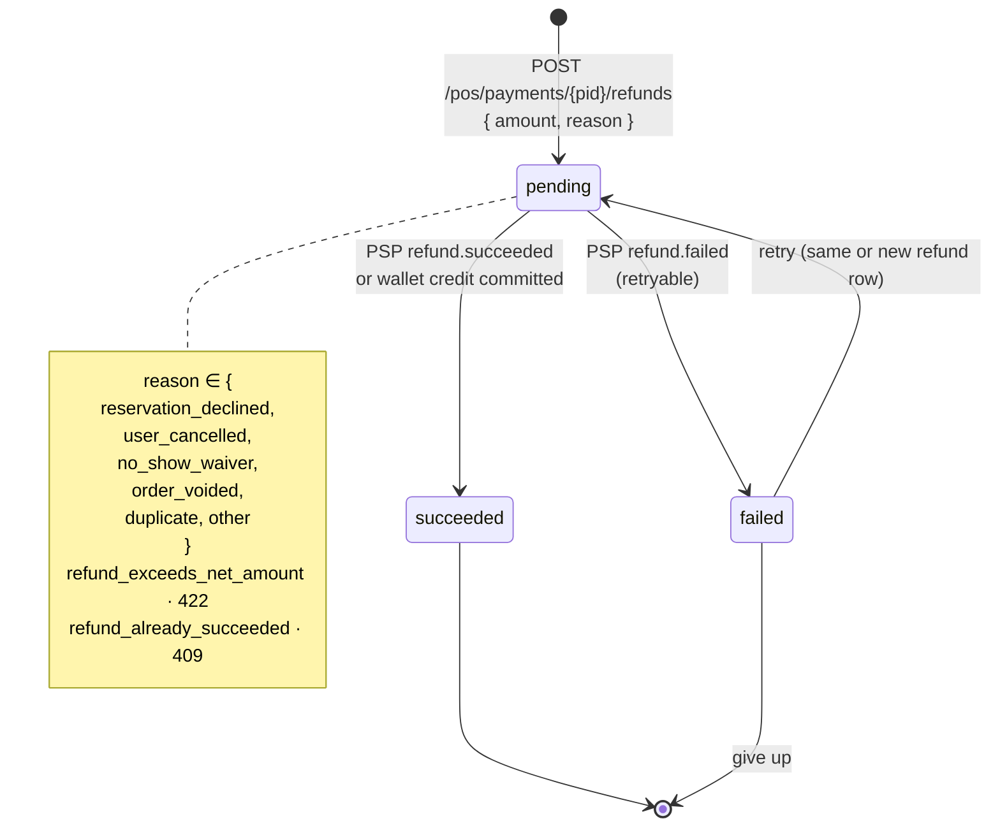
```mermaid
stateDiagram-v2
    [*] --> pending : POST /pos/payments/{pid}/refunds<br/>{ amount, reason }
    pending --> succeeded : PSP refund.succeeded<br/>or wallet credit committed
    pending --> failed : PSP refund.failed<br/>(retryable)
    failed --> pending : retry (same or new refund row)

    succeeded --> [*]
    failed --> [*] : give up

    note right of pending
      reason ∈ {
        reservation_declined,
        user_cancelled,
        no_show_waiver,
        order_voided,
        duplicate, other
      }
      refund_exceeds_net_amount · 422
      refund_already_succeeded · 409
    end note
```

### 17. Wallet top-up (PSP webhook + poll fallback)

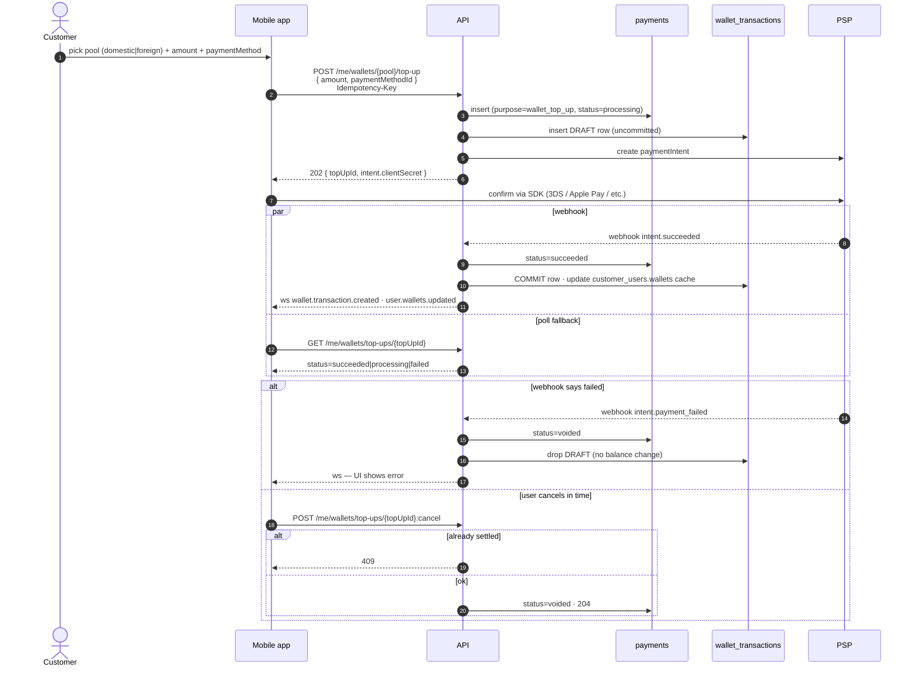
```mermaid
sequenceDiagram
    autonumber
    actor U as Customer
    participant App as Mobile app
    participant API as API
    participant Pay as payments
    participant Ledger as wallet_transactions
    participant PSP as PSP

    U->>App: pick pool (domestic|foreign) + amount + paymentMethod
    App->>API: POST /me/wallets/{pool}/top-up<br/>{ amount, paymentMethodId }<br/>Idempotency-Key
    API->>Pay: insert (purpose=wallet_top_up, status=processing)
    API->>Ledger: insert DRAFT row (uncommitted)
    API->>PSP: create paymentIntent
    API-->>App: 202 { topUpId, intent.clientSecret }

    App->>PSP: confirm via SDK (3DS / Apple Pay / etc.)

    par webhook
        PSP-->>API: webhook intent.succeeded
        API->>Pay: status=succeeded
        API->>Ledger: COMMIT row · update customer_users.wallets cache
        API-->>App: ws wallet.transaction.created · user.wallets.updated
    and poll fallback
        App->>API: GET /me/wallets/top-ups/{topUpId}
        API-->>App: status=succeeded|processing|failed
    end

    alt webhook says failed
        PSP-->>API: webhook intent.payment_failed
        API->>Pay: status=voided
        API->>Ledger: drop DRAFT (no balance change)
        API-->>App: ws — UI shows error
    else user cancels in time
        App->>API: POST /me/wallets/top-ups/{topUpId}:cancel
        alt already settled
            API-->>App: 409
        else ok
            API->>Pay: status=voided · 204
        end
    end
```

### 18. Ledger + cache pattern

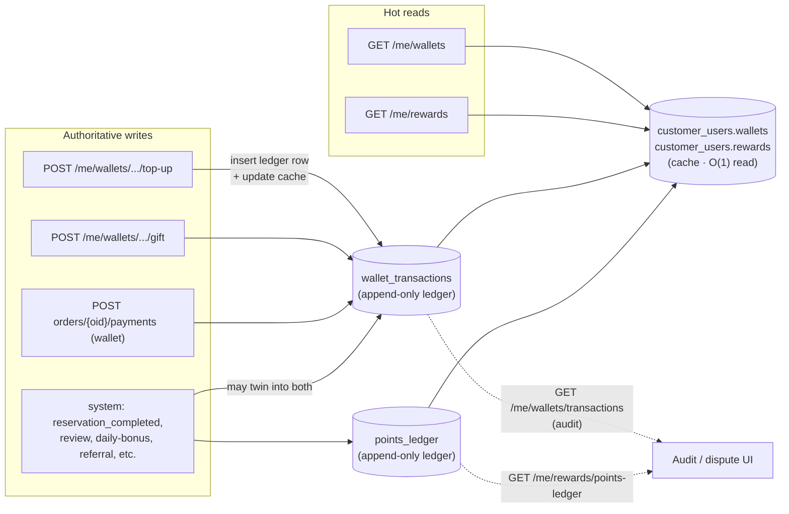
```mermaid
flowchart LR
    subgraph Reads["Hot reads"]
        R1["GET /me/wallets"]
        R2["GET /me/rewards"]
    end
    subgraph Writes["Authoritative writes"]
        W1["POST /me/wallets/.../top-up"]
        W2["POST /me/wallets/.../gift"]
        W3["POST orders/{oid}/payments  (wallet)"]
        W4["system: reservation_completed,<br/>review, daily-bonus, referral, etc."]
    end

    Cache[("customer_users.wallets<br/>customer_users.rewards<br/>(cache · O(1) read)")]
    LedgerW[("wallet_transactions<br/>(append-only ledger)")]
    LedgerP[("points_ledger<br/>(append-only ledger)")]

    R1 --> Cache
    R2 --> Cache

    W1 -->|"insert ledger row<br/>+ update cache"| LedgerW
    W2 --> LedgerW
    W3 --> LedgerW
    W4 -->|"may twin into both"| LedgerW
    W4 --> LedgerP

    LedgerW --> Cache
    LedgerP --> Cache
    LedgerW -. "GET /me/wallets/transactions<br/>(audit)" .-> Audit[Audit / dispute UI]
    LedgerP -. "GET /me/rewards/points-ledger" .-> Audit
```

### 19. Subscription state

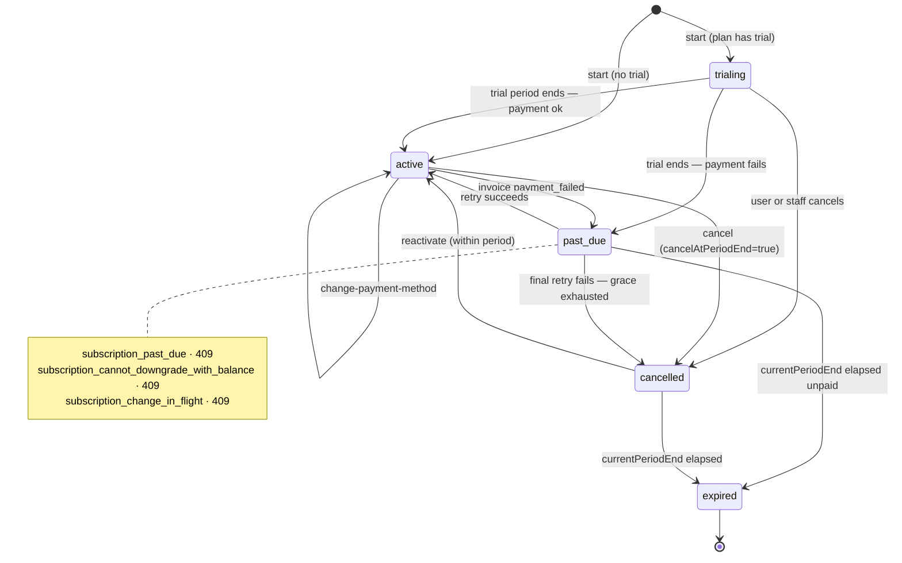
```mermaid
stateDiagram-v2
    [*] --> trialing : start (plan has trial)
    [*] --> active   : start (no trial)

    trialing --> active   : trial period ends — payment ok
    trialing --> past_due : trial ends — payment fails
    trialing --> cancelled : user or staff cancels

    active --> past_due  : invoice payment_failed
    active --> cancelled : cancel (cancelAtPeriodEnd=true)
    active --> active    : change-plan (proration logged in history)
    active --> active    : change-payment-method

    past_due --> active    : retry succeeds
    past_due --> cancelled : final retry fails — grace exhausted
    past_due --> expired   : currentPeriodEnd elapsed unpaid

    cancelled --> active : reactivate (within period)
    cancelled --> expired : currentPeriodEnd elapsed
    expired --> [*]

    note right of past_due
      subscription_past_due · 409
      subscription_cannot_downgrade_with_balance · 409
      subscription_change_in_flight · 409
    end note
```

### 20. Invoice state

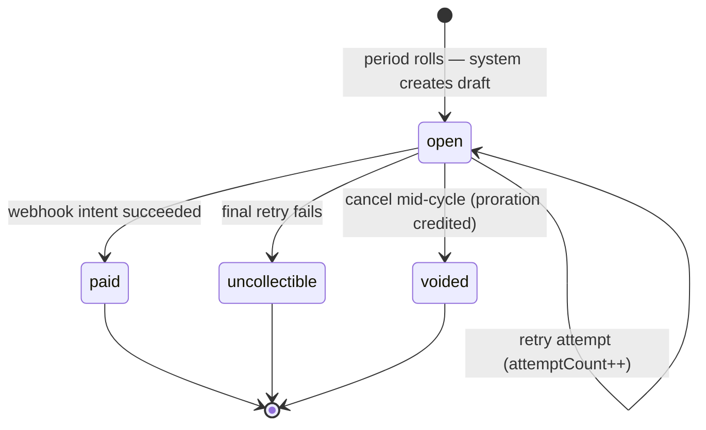
```mermaid
stateDiagram-v2
    [*] --> open : period rolls — system creates draft
    open --> paid : webhook intent succeeded
    open --> open : retry attempt (attemptCount++)
    open --> uncollectible : final retry fails
    open --> voided : cancel mid-cycle (proration credited)

    paid --> [*]
    uncollectible --> [*]
    voided --> [*]
```

### 21. Support conversation lifecycle

```mermaid
stateDiagram-v2
    [*] --> open : POST /me/support/conversations
    open --> pending_agent : user posts message<br/>or system triage
    pending_agent --> pending_user : agent replies
    pending_user --> pending_agent : user replies
    pending_user --> resolved : agent marks resolved
    pending_agent --> resolved : agent marks resolved
    resolved --> closed : 7 days no activity (auto)
    resolved --> pending_user : user replies (re-opens)
    closed --> [*]

    note right of closed
      conversation_closed · 409
      message_too_long · 422
    end note
```

### 22. Notifications fanout

```mermaid
flowchart TD
    Ev["Domain event<br/>(reservation.confirmed,<br/>order.paid, etc.)"] --> Builder["Notification builder<br/>(template + locale)"]
    Builder --> Doc[(notifications doc)]
    Doc --> Feed["Customer feed<br/>GET /me/notifications"]
    Doc --> StaffFeed["Staff feed (POS)"]

    Builder -->|"channel=push"| Push["FCM / APNs / web-push"]
    Builder -->|"channel=email"| Email["Email gateway"]
    Builder -->|"channel=sms"| Sms["SMS gateway"]

    Doc -. "ws notification.created<br/>+ user.notifications.unreadCountChanged" .-> Live[Live badge & toast]

    Feed -->|"POST read / mark-all-read"| Doc
    Feed -->|"DELETE"| Doc
    Doc -. "ws notification.read / notification.deleted" .-> Live
```

### 23. Realtime channel map

```mermaid
flowchart LR
    subgraph EntityRes["reservations"]
        rc["reservation.created<br/>reservation.updated<br/>reservation.cancelled<br/>reservation.invite.updated"]
    end
    subgraph EntityOrd["orders"]
        oc["order.updated<br/>order.item.added<br/>order.item.updated<br/>order.item.voided<br/>order.bill.finalized<br/>order.paid<br/>order.batch.sent<br/>order.batch.accepted<br/>order.batch.completed"]
    end
    subgraph EntityTbl["tables"]
        tc["table.created<br/>table.updated<br/>table.deleted"]
    end
    subgraph EntityPay["payments"]
        pc["payment.captured<br/>payment.voided<br/>payment.refund.requested<br/>payment.refund.succeeded<br/>payment.refund.failed"]
    end
    subgraph EntityWal["wallets / rewards"]
        wc["wallet.transaction.created<br/>user.wallets.updated<br/>points.ledger.created<br/>user.rewards.updated"]
    end
    subgraph EntityNotif["notifications / profile"]
        nc["notification.created<br/>notification.read<br/>notification.deleted<br/>user.notifications.unreadCountChanged<br/>user.profile.updated<br/>user.friends.updated"]
    end
    subgraph EntitySub["subscriptions / support"]
        sc["subscription.created · updated<br/>subscription.invoice.created · paid · failed<br/>support.conversation.created · updated<br/>support.message.created"]
    end
    subgraph EntityRest["restaurant"]
        rsc["restaurant.profile.updated<br/>restaurant.menu.updated<br/>restaurant.settings.updated<br/>restaurant.staff.pending"]
    end

    Cust[Customer app]:::actor
    Pos[POS app]:::actor

    rc --> Cust
    rc --> Pos
    oc --> Pos
    oc -. "(only if reservation.customerId matches)" .-> Cust
    tc --> Pos
    pc --> Pos
    pc -. "customer-related events" .-> Cust
    wc --> Cust
    nc --> Cust
    nc -. staff variants .-> Pos
    sc --> Cust
    sc --> Pos
    rsc --> Pos
    rsc -. "menu.updated only" .-> Cust

    classDef actor fill:#fce8b2,stroke:#a87a00,color:#3a2a00
```

### 24. Idempotency-Key handling

```mermaid
sequenceDiagram
    autonumber
    participant App
    participant API
    participant Cache as idempotency cache (24h)
    participant DB

    App->>API: POST /reservations<br/>Idempotency-Key: 8f2c-...
    API->>Cache: lookup
    alt miss
        API->>DB: do the work · attach response
        API->>Cache: store(key → response, body-hash)
        API-->>App: 201 (no replay header)
    else hit · same body
        API-->>App: 201/200 + Idempotency-Replay: true
    else hit · different body
        API-->>App: 409 idempotency_key_conflict
    end

    Note over App,API: Clients SHOULD generate a fresh ULID per logical action,<br/>not per retry. Retries reuse the same key.
```

### 25. Error response + retry decision

```mermaid
flowchart TD
    R["HTTP response"] --> S{"status?"}
    S -- "2xx" --> OK([done])
    S -- "400 bad_request"        --> Fix["Fix payload — never retry"]
    S -- "401 token_expired"      --> Refresh["Refresh token, then retry once"]
    S -- "401 unauthenticated"    --> SignIn["Force sign-in"]
    S -- "403"                    --> Fix
    S -- "404"                    --> Fix
    S -- "409 idempotency_key_conflict" --> NewKey["Generate new key, retry"]
    S -- "409 invalid_transition / *_already_*" --> Inspect["Refresh resource, decide"]
    S -- "410 invite_expired"     --> Inspect
    S -- "422 validation_failed"  --> ShowErrors["Show field errors[]"]
    S -- "423 *_attempts_exceeded" --> Lockout["Show lockout · cool-down"]
    S -- "429 too_many_requests"  --> Backoff["Wait Retry-After<br/>then retry (max 3)"]
    S -- "5xx"                    --> Backoff5["Exp backoff jitter<br/>idempotent ops only"]

    classDef bad fill:#fee,stroke:#a00,color:#600
    class Fix,SignIn,ShowErrors,Lockout bad
```

### 26. Pagination patterns

```mermaid
flowchart LR
    subgraph Offset["Offset · admin lists"]
        O1["GET ...?page=1&pageSize=20"] --> O2["{ items, page, pageSize, total }"]
        O2 -->|"page = page+1<br/>while items*page < total"| O1
    end
    subgraph Cursor["Cursor · ledgers + feeds"]
        C1["GET ...?limit=50"] --> C2["{ items, nextCursor }"]
        C2 -->|"if nextCursor != null<br/>?cursor=<opaque>"| C3["GET ...?limit=50&cursor=..."]
        C3 --> C2
    end
```

### 27. Table status state machine

```mermaid
stateDiagram-v2
    [*] --> available
    available --> reserved : reservation.confirmed for<br/>upcoming slot
    available --> occupied : POS opens order on table
    reserved --> occupied  : QR check-in / POS check-in
    reserved --> available : reservation cancelled / no_show
    occupied --> needs_cleaning : order paid · party leaves
    needs_cleaning --> available : POS marks clean
    available --> out_of_service : manager flag
    out_of_service --> available : manager unflag

    note right of out_of_service
      Cannot accept reservations or orders.
    end note
```

### 28. Friend-edge state machine

```mermaid
stateDiagram-v2
    [*] --> pending_outgoing : Alice sends a friend request to Bob
    [*] --> pending_outgoing : phone invite (source=phone_invite)
    pending_outgoing --> accepted : Bob accepts
    pending_outgoing --> declined : Bob declines
    pending_outgoing --> [*]      : Alice cancels

    accepted --> blocked : either party blocks
    blocked --> [*] : unblock (re-friend manually)
    declined --> [*]
    accepted --> [*] : DELETE /me/friends/(friendId)

    note right of pending_outgoing
      mirror edge on Bob.friends:
        status = pending_incoming
    end note
```

### 29. Daily bonus + referral redemption

```mermaid
sequenceDiagram
    autonumber
    actor U as Customer
    participant API
    participant Cu as customer_users
    participant LW as wallet_transactions
    participant LP as points_ledger

    U->>API: GET /me/daily-bonus
    API-->>U: { available, lastClaimedDate, history[] }

    alt already claimed today
        API-->>U: 409 daily_bonus_already_claimed
    else available
        U->>API: POST /me/daily-bonus:claim (selectedBox 0/1/2, Idempotency-Key)
        API->>API: roll reward (points or bonus_credit or coupon)
        opt reward.kind is points
            API->>LP: insert (reason=daily_bonus, direction=credit)
        end
        opt reward.kind is bonus_credit
            API->>LW: insert (pool=bonus, type=daily_bonus)
        end
        API->>Cu: append dailyBonus.history and update lastClaimedDate
        API-->>U: 200 with reward and balances
        API-->>U: ws user.wallets.updated and user.rewards.updated
    end

    Note over U,API: Referral redemption mirrors this. POST /me/referral:redeem with code rewards both redeemer and referrer. Errors include referral_already_redeemed and referral_self_redeem.
```

### 30. Permissions matrix

```mermaid
flowchart LR
    subgraph Roles
        Mgr["manager"]
        Cs["cashier"]
        Wt["waiter"]
        Cf["chef"]
    end

    subgraph Perms["Common permission flags"]
        P1["restaurant.settings"]
        P2["staff.manage"]
        P3["menu.edit"]
        P4["floors.edit"]
        P5["tables.edit"]
        P6["orders.take"]
        P7["payments.process"]
        P8["payments.refund"]
        P9["kitchen.act"]
        P10["analytics.view"]
        P11["reservations.approve"]
    end

    Mgr --> P1 & P2 & P3 & P4 & P5 & P6 & P7 & P8 & P10 & P11
    Cs  --> P6 & P7
    Wt  --> P6 & P11
    Cf  --> P9

    Perms -. "missing → 403 missing_permission" .-> Err[(error)]
    Roles -. "wrong role → 403 missing_role" .-> Err
    Note["TODO: verify exact permission strings"]:::todo
    classDef todo fill:#fff7c2,stroke:#a87a00,color:#3a2a00,stroke-dasharray: 4 2
```
